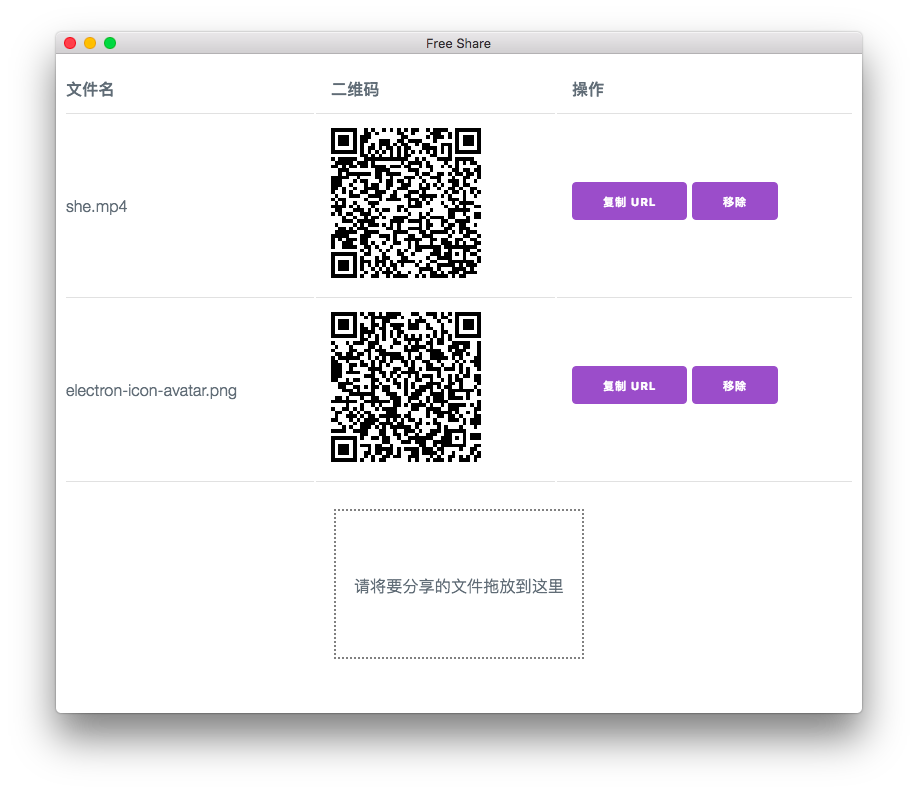

# free-share



通过一条链接与他人分享本地的文件，基于 [js-psychokinesis](https://github.com/psychokinesis-dev/js-psychokinesis) 构建。

## 特性
- 快速分享，无需将文件上传至服务器即可与他人分享。
- 扫码获取文件，方便在移动终端间使用。
- 基于开放的去中心化网络，不受第三方控制且极易扩展。

## 构建
```bash
$ apt-get install nodejs npm
$ npm install
$ npm install -g bower
$ bower install
```

## 启动
```bash
$ npm start
```

## 打包
```bash
$ npm run-script pack
```

温馨提示：非 Windows 平台下打包请提前安装 wine ，具体说明参看[这里](https://github.com/electron-userland/electron-packager#building-windows-apps-from-non-windows-platforms)。

完成后各平台对应的可执行程序位于上层目录的 free-share-dist 下。